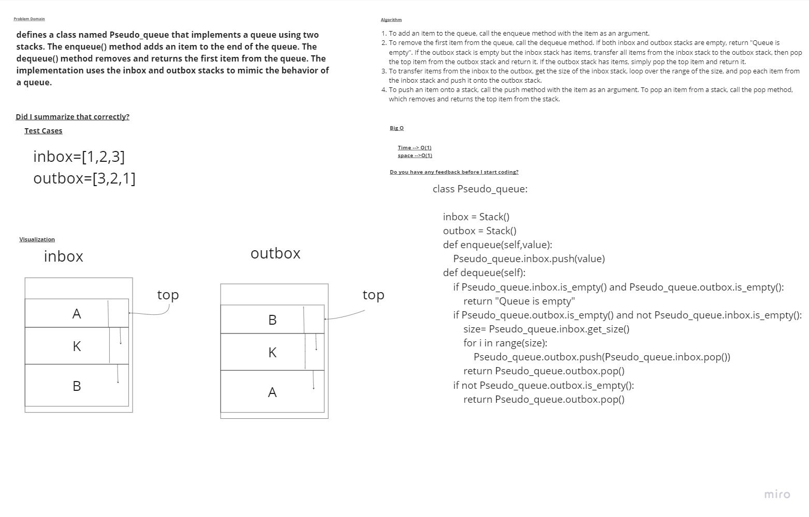

# Challenge Title
##  Implementation:stack_Queue_Pseudo
# Whiteboard Process

## Setup
req.txt to install the requred


### to test code 
install pytest to run the test
 ```
 pytest
 ```
 ### to run a code 
 ```
 python -m challenges.challenge11.stackQueuePseudo
 ```