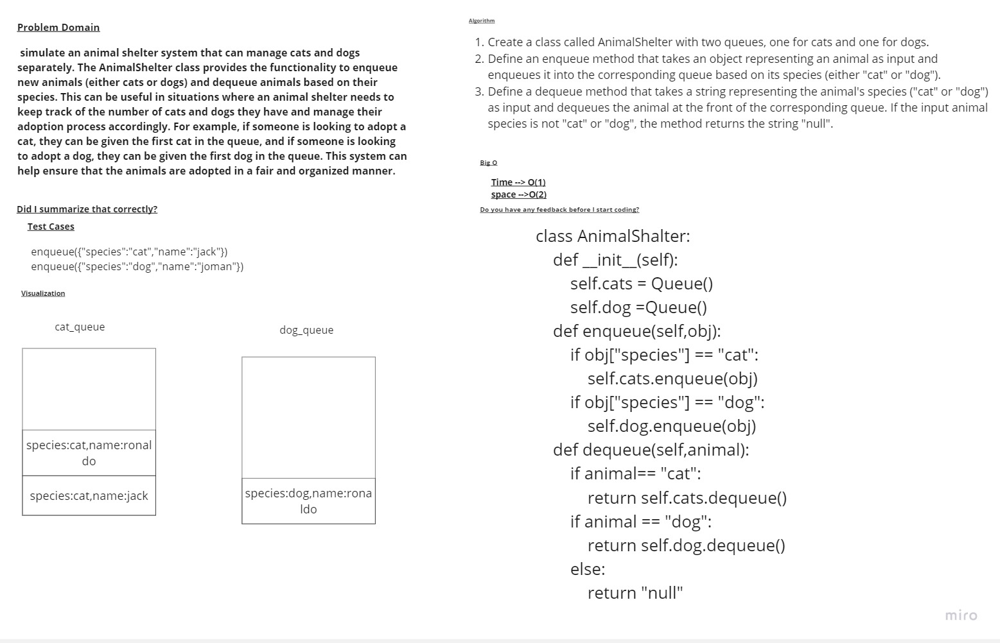

# Challenge Title
##  Implementation:First-in, First out Animal Shelter.
# Whiteboard Process

## Setup
requirement.txt to install the requred


### to test code 
install pytest to run the test
 ```
 pytest
 ```
 ### to run a code 
 ```
 python -m challenges.challenge12.stack_queue_animal_shelter
 ```