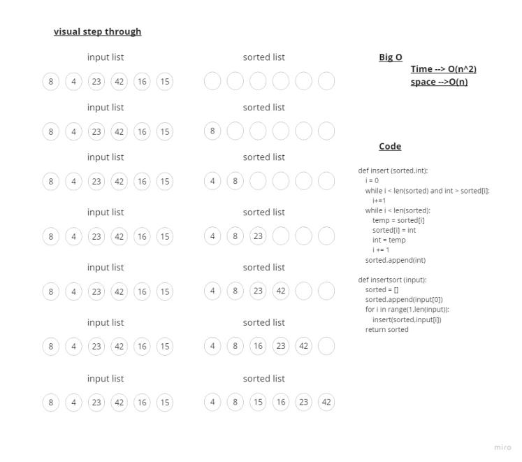

# Challenge Title
##  Insertion Sort
# Whiteboard Process

## Setup
requirement.txt to install the requred


### to test code 
install pytest to run the test
 ```
 pytest
 ```
 ### to run a code 
 ```
 /home/mohammad/data-structures-and-algorithms/.venv/bin/python /home/mohammad/data-structures-and-algorit
hms/challenges/challenge26/Insertion_Sort.py
 ```

 # Insertion Sort Algorithm - Step-by-Step Process

## Test Case 1: [5, 2, 8, 3, 1]

### Initial State
- Sorted: [5]
- Value: 2

### Step 1
- Compare 2 with 5: 2 < 5
- Insert 2 into the sorted array at index 0: sorted = [2, 5]

### Step 2
- Move to the next element: value = 8

### Step 3
- Compare 8 with 5: 8 > 5
- Insert 8 into the sorted array at index 1: sorted = [2, 5, 8]

### Step 4
- Move to the next element: value = 3

### Step 5
- Compare 3 with 8: 3 < 8
- Insert 3 into the sorted array at index 1: sorted = [2, 3, 5, 8]

### Step 6
- Move to the next element: value = 1

### Step 7
- Compare 1 with 8: 1 < 8
- Compare 1 with 5: 1 < 5
- Compare 1 with 3: 1 < 3
- Insert 1 into the sorted array at index 0: sorted = [1, 2, 3, 5, 8]

### Final State
- Sorted array: [1, 2, 3, 5, 8]
---------------------------
# Insertion Sort Algorithm - Step-by-Step Process

## Test Case 2: [10, 5, 7, 2, 9, 1]

### Initial State
- Sorted: [10]
- Value: 5

### Step 1
- Compare 5 with 10: 5 < 10
- Insert 5 into the sorted array at index 0: sorted = [5, 10]

### Step 2
- Move to the next element: value = 7

### Step 3
- Compare 7 with 10: 7 < 10
- Insert 7 into the sorted array at index 1: sorted = [5, 7, 10]

### Step 4
- Move to the next element: value = 2

### Step 5
- Compare 2 with 10: 2 < 10
- Insert 2 into the sorted array at index 0: sorted = [2, 5, 7, 10]

### Step 6
- Move to the next element: value = 9

### Step 7
- Compare 9 with 10: 9 < 10
- Insert 9 into the sorted array at index 3: sorted = [2, 5, 7, 9, 10]

### Step 8
- Move to the next element: value = 1

### Step 9
- Compare 1 with 10: 1 < 10
- Compare 1 with 9: 1 < 9
- Compare 1 with 7: 1 < 7
- Compare 1 with 5: 1 < 5
- Insert 1 into the sorted array at index 0: sorted = [1, 2, 5, 7, 9, 10]

### Final State
- Sorted array: [1, 2, 5, 7, 9, 10]
