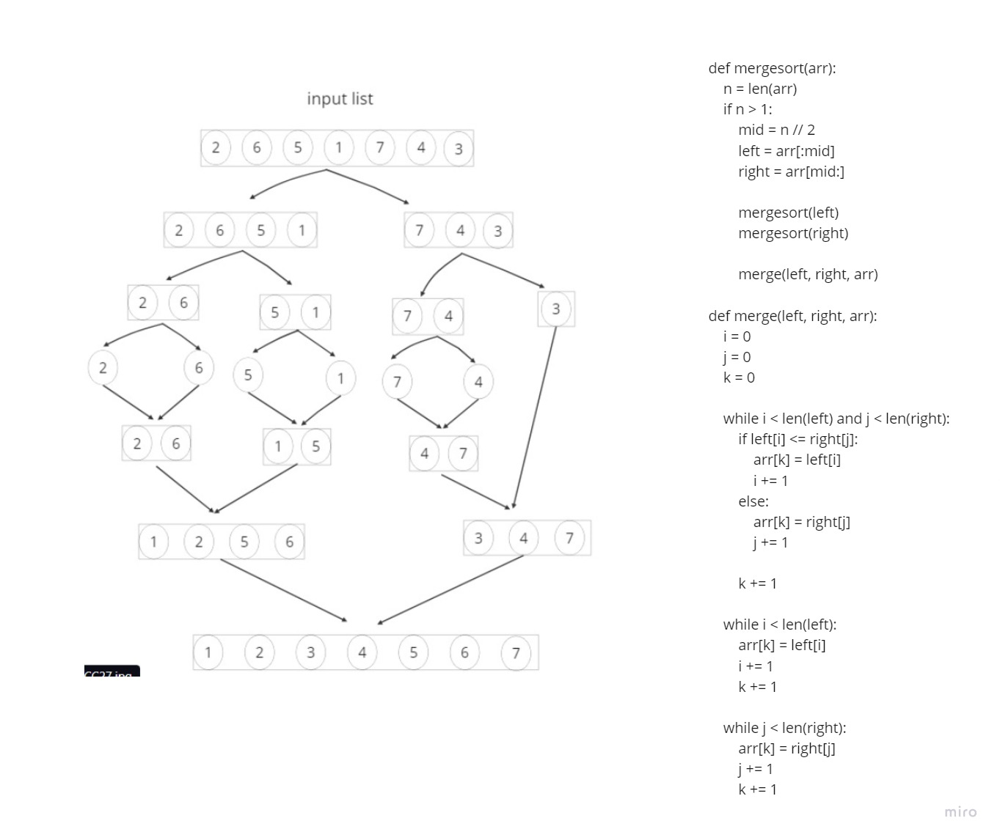

# Challenge Title
##  Merge Sort
# Whiteboard Process

## Setup
requirement.txt to install the requred


### to test code 
install pytest to run the test
 ```
 pytest
 ```
 ### to run a code 
 ```
 /home/mohammad/data-structures-and-algorithms/.venv/bin/python /home/mohammad/data-structures-and-algorit
hms/challenges/challenge27/merge_Sort.py
 ```

### Step 1:
- The original array is [4, 2, 7, 1, 5, 3].
- We start with the Mergesort function and calculate the length of the array, which is 6.
- Since the length is greater than 1, we proceed to divide the array into two halves.
```
Left array: [4, 2, 7]
Right array: [1, 5, 3]

```
### Step 2:
We recursively call the Mergesort function on both the left and right halves.

For the left half:
```
Left array: [4, 2, 7]

```
We calculate the length, which is 3, and it's greater than 1. So we divide it further:
```
Left array: [4]
Right array: [2, 7]

```
Now, we again calculate the length of the right half, which is 2, and it's also greater than 1. So we divide it further:
```
Left array: [2]
Right array: [7]

```
Since the length of both halves is 1, we cannot divide them any further.

For the right half:
```
Left array: [1]
Right array: [5, 3]

```
We calculate the length of the right half, which is 2, and it's greater than 1. So we divide it further:
```
Left array: [5]
Right array: [3]

```
Since the length of both halves is 1, we cannot divide them any further.

### Step 3:
Now, we move to the Merge function to merge the sorted halves.

For the left half:
```
Left array: [2]
Right array: [7]

```
Comparing the first elements of both arrays, we find that 2 is smaller than 7. So we place 2 in the original array.
```
Array: [2, _, _, _, _, _]

```
We increment the index for the left array and the index for the original array. 
```
Left array: [_]
Right array: [7]
Array: [2, _, _, _, _, _]

```
Since there are no more elements in the left array, we copy the remaining elements from the right array to the original array.
```
Left array: [_]
Right array: [_]
Array: [2, 7, _, _, _, _]

```


