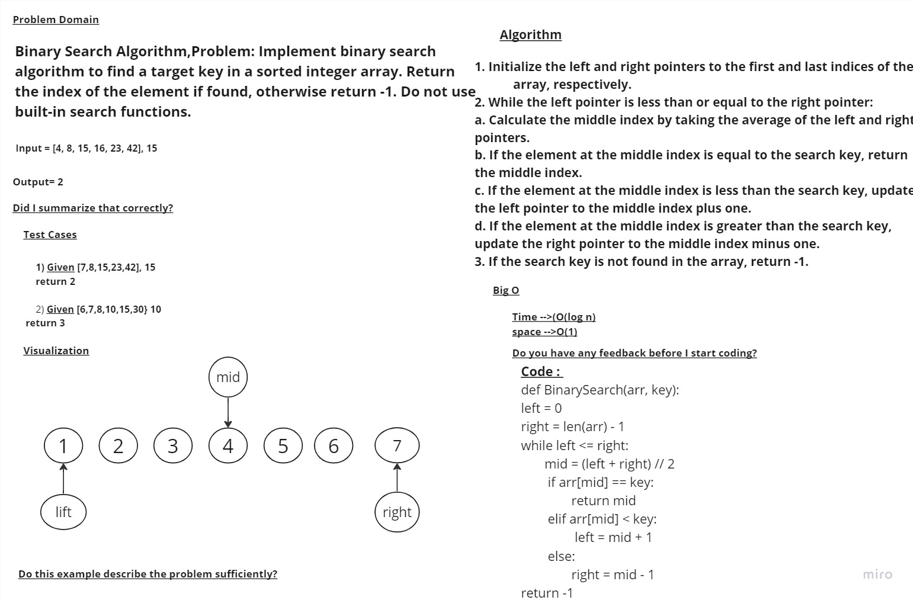

# Challenge Title
## array-binary-search
---
# Whiteboard Process


# Approach & Efficiency
The time complexity of the BinarySearch function is O(log n), where n is the length of the input array. This is because the algorithm divides the search space in half with each iteration, so the number of iterations required is logarithmic in the size of the input. This is much faster than a linear search, which would have a worst-case time complexity of O(n).

The space complexity of the BinarySearch function is O(1), because it only uses a constant amount of additional memory to store the pointers and other temporary variables. Therefore, the function has an efficient space complexity as well.
## Solution
```
def BinarySearch(arr, key):
    left = 0
    right = len(arr) - 1

    while left <= right:
        mid = (left + right) // 2
        if arr[mid] == key:
            return mid
        elif arr[mid] < key:
            left = mid + 1
        else:
            right = mid - 1

    return -1
```