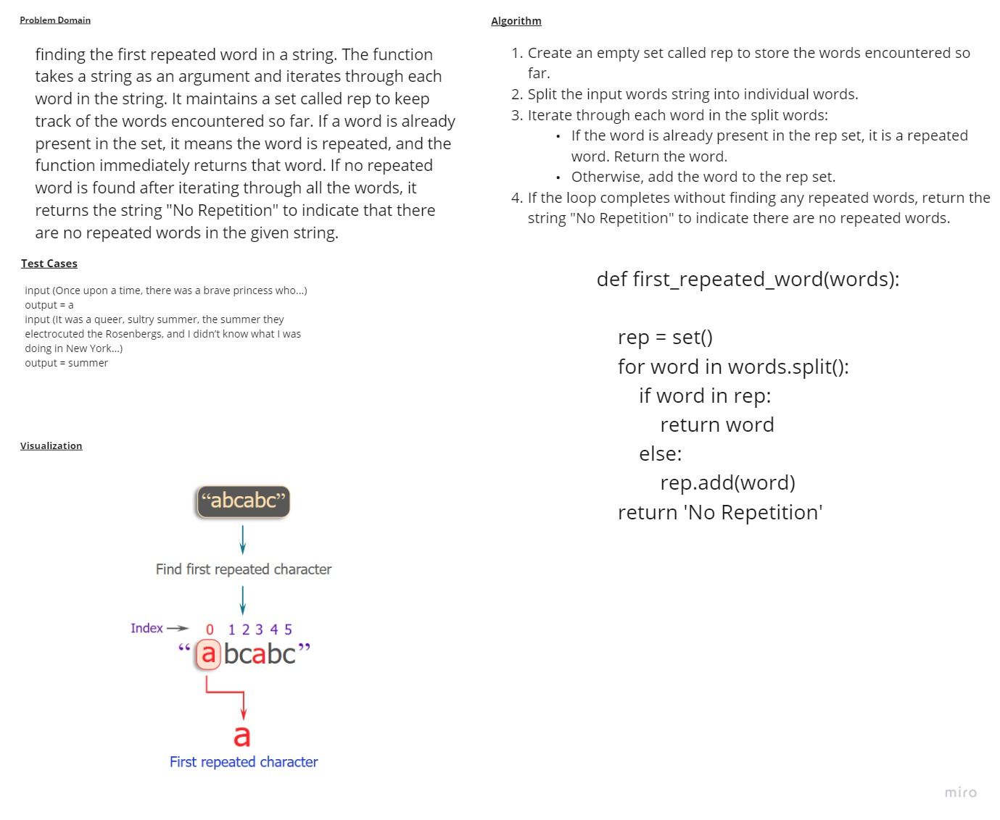

# HashTable
# Whiteboard 

## Approach & Efficiency
### Time --> O(m) m is the number of words until reaching the repeated word
### space -->O(m) m is the number of words until reaching the repeated word
## solution
```
def first_repeated_word(str):
    hash_map = {}
    for word in str.split():
        if word.lower() in hash_map:
            return word
        else:
            hash_map[word.lower()] = True
```
## to run a code 
```
/home/mohammad/data-structures-and-algorithms/.venv/bin/python /home/mohammad/data-structures-and-algorithms/c
hallenges/challenge30/main.py
```
## to test a code 
```
pytest
```