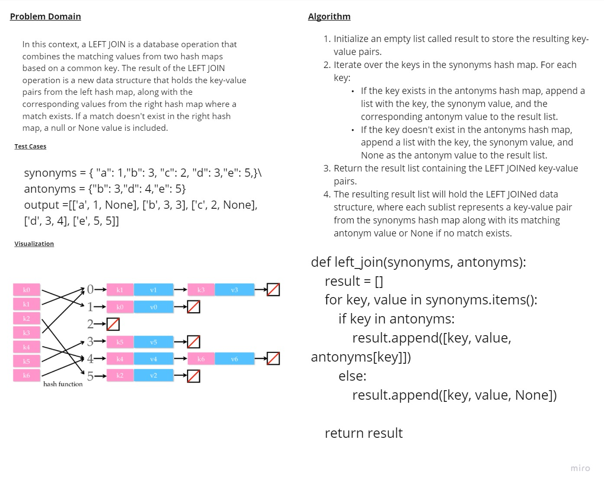

# hashmap-left-join
# Whiteboard 

## Approach & Efficiency
### The time complexity of this function is O(m), where m is the number of words until reaching the repeated word.
### The space complexity of this function is O(m), where m is the number of words until reaching the repeated word.
## solution
```
def left_join(synonyms, antonyms):
    result = []

    for key, value in synonyms.items():
        if key in antonyms:
            result.append([key, value, antonyms[key]])
        else:
            result.append([key, value, None])

    return result
```
## to run a code 
```
/home/mohammad/data-structures-and-algorithms/.venv/bin/python /home/mohammad/data-structures-and-algorithms/c
hallenges/challenge30/main.py
```
## to test a code 
```
pytest
```