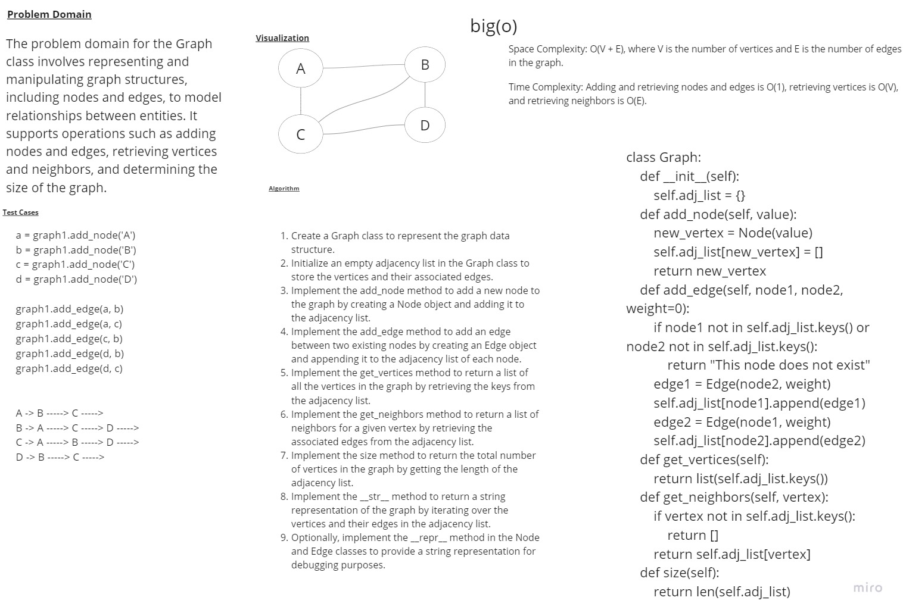

# Graphs
# Whiteboard 

## Approach & Efficiency

## Space Complexity: O(V + E), where V is the number of vertices and E is the number of edges in the graph.
## Time Complexity: Adding and retrieving nodes and edges is O(1), retrieving vertices is O(V), and retrieving neighbors is O(E).
## The complexities are based on efficient data structures used and assume constant time operations.
## solution
```
class Graph:
    def __init__(self):
        self.adj_list = {}
    def add_node(self, value):
        new_vertex = Node(value)
        self.adj_list[new_vertex] = []
        return new_vertex
    def add_edge(self, node1, node2, weight=0):
        if node1 not in self.adj_list.keys() or node2 not in self.adj_list.keys():
            return "This node does not exist"
        edge1 = Edge(node2, weight)
        self.adj_list[node1].append(edge1)
        edge2 = Edge(node1, weight)
        self.adj_list[node2].append(edge2)
    def get_vertices(self):
        return list(self.adj_list.keys())
    def get_neighbors(self, vertex):
        if vertex not in self.adj_list.keys():
            return []
        return self.adj_list[vertex]
    def size(self):
        return len(self.adj_list)
```
## to run a code 
```
/home/mohammad/data-structures-and-algorithms/.venv/bin/python /home/mohammad/data-structures-and-algorithms/c
hallenges/challenge35/main.py
```
## to test a code 
```
pytest
```