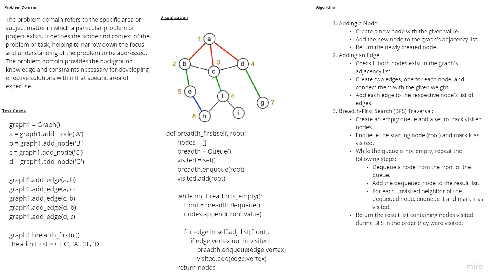

# Graphs_breadth_first
# Whiteboard 

## Approach & Efficiency

## Space Complexity: The space complexity of the breadth_first method is O(V), where V is the number of vertices (nodes) in the graph. This is because, at any point during the BFS traversal, the queue (breadth) can contain at most all the vertices in the graph. Additionally, we use a set (visited) to keep track of visited nodes, which also takes up space proportional to the number of vertices in the graph.
## Time Complexity: The time complexity of the breadth_first method is O(V + E), where V is the number of vertices (nodes) in the graph, and E is the number of edges. This is because the method visits each vertex and each edge in the graph at most once during the BFS traversal. The dominant operation within the method is the while loop, which iterates through the nodes in the queue.

## solution
```
def breadth_first(self, root):
        nodes = []
        breadth = Queue()
        visited = set()

        breadth.enqueue(root)
        visited.add(root)

        while not breadth.is_empty():
            front = breadth.dequeue()
            nodes.append(front.value)

            for edge in self.adj_list[front]:
                if edge.vertex not in visited:
                    breadth.enqueue(edge.vertex)
                    visited.add(edge.vertex)

        return nodes
```
## to run a code 
```
/home/mohammad/data-structures-and-algorithms/.venv/bin/python /home/mohammad/data-structures-and-algorithms/c
hallenges/challenge36/main.py
```
## to test a code 
```
pytest
```