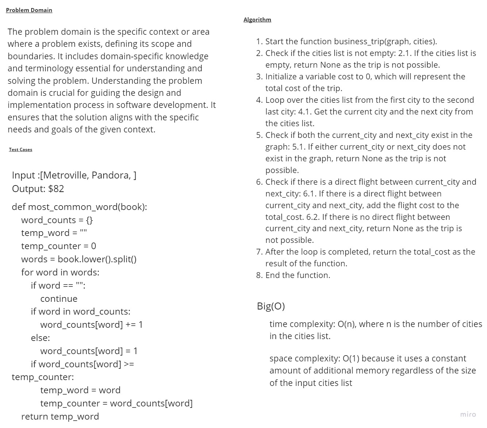

# Graphs_business_trip
# Whiteboard 

## Approach & Efficiency

## Space Complexity: O(1) because it uses a constant amount of additional memory regardless of the size of the input cities list.
## Time Complexity:  O(n), where n is the number of cities in the cities list

## solution
```
def business_trip(graph, cities):
    if not cities:
        return None

    cost = 0

    for i in range(len(cities) - 1):
        current_city = cities[i]
        next_city = cities[i + 1]

        # Check if both current_city and next_city exist in the graph
        if current_city not in graph.adj_list or next_city not in graph.adj_list:
            return None

        # Check if there is a direct flight between current_city and next_city
        direct_flight = False
        for edge in graph.adj_list[current_city]:
            if edge.vertex == next_city:
                cost += edge.weight
                direct_flight = True
                break

        if not direct_flight:
            return None

    return cost

```
## to run a code 
```
/home/mohammad/data-structures-and-algorithms/.venv/bin/python /home/mohammad/data-structures-and-algorithms/c
hallenges/challenge37/main.py
```
## to test a code 
```
pytest
```