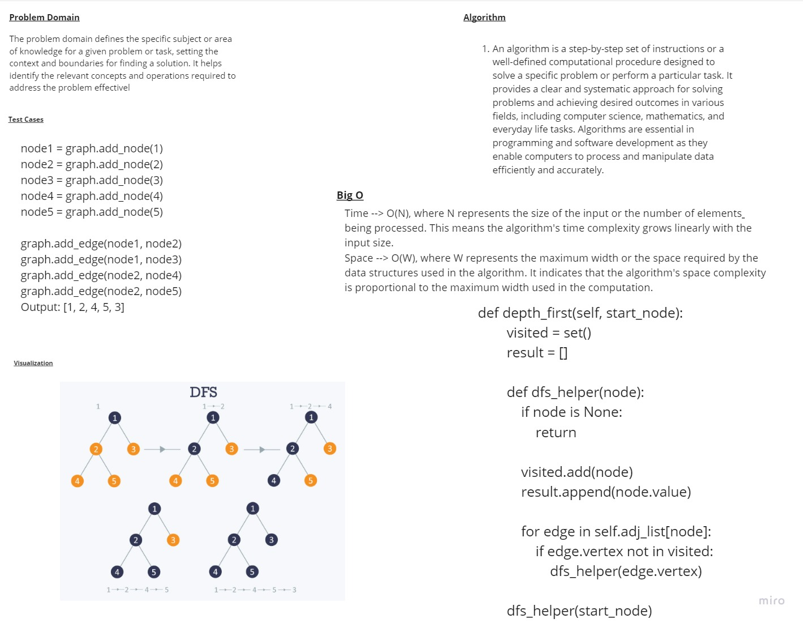

# depth_first
# Whiteboard 

## Approach & Efficiency
## Time --> O(N), where N refers to the size of the input or the number of elements being processed. This means the algorithm's time complexity grows linearly with the input size.

## Space --> O(W), where W represents the maximum workspace or the memory required by the data structures used in the algorithm. It indicates that the algorithm's space complexity is proportional to the maximum workspace used during the computation.
## solution
```
def depth_first(self, start_node):
        visited = set()
        result = []

        def dfs_helper(node):
            if node is None:
                return

            visited.add(node)
            result.append(node.value)

            for edge in self.adj_list[node]:
                if edge.vertex not in visited:
                    dfs_helper(edge.vertex)

        dfs_helper(start_node)
        return result
```
## to run a code 
```
/home/mohammad/data-structures-and-algorithms/.venv/bin/python /home/mohammad/data-structures-and-algorithms/c
hallenges/challenge38/main.py
```
## to test a code 
```
pytest
```