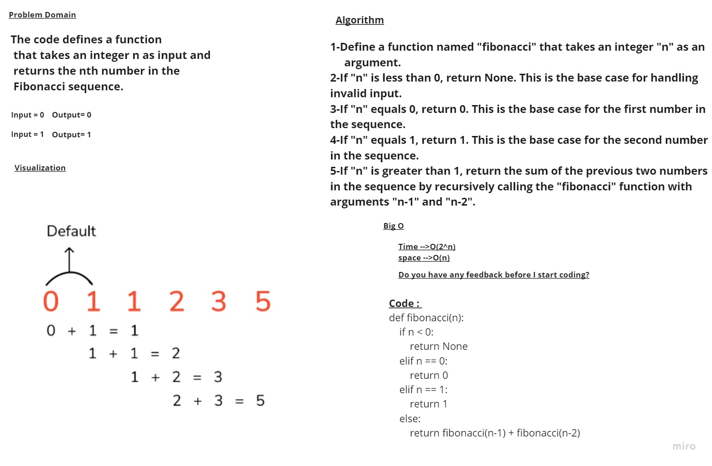

# Challenge Title
##  Fibonacci
---
# Whiteboard Process


# Approach & Efficiency
The time complexity of the Fibonacci algorithm using recursion is O(2^n). This is because the algorithm recursively calls itself twice for every value of "n" greater than 1. As a result, the number of function calls increases exponentially with "n". This can lead to a significant slowdown for larger values of "n".

Therefore, this algorithm is not very efficient for larger values of "n". One way to improve the performance is to use dynamic programming techniques to store the previously calculated values of the sequence and avoid redundant computations. This can reduce the time complexity to O(n) and make the algorithm more efficient for larger values of "n".
## Solution
```
def fibonacci(n):
    if n < 0:
        return None
    elif n == 0:
        return 0
    elif n == 1:
        return 1
    else:
        return fibonacci(n-1) + fibonacci(n-2)
```