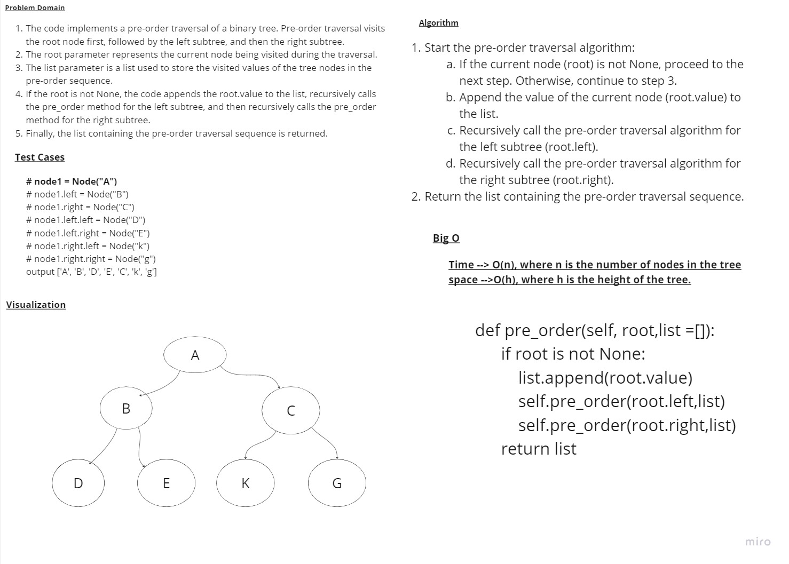
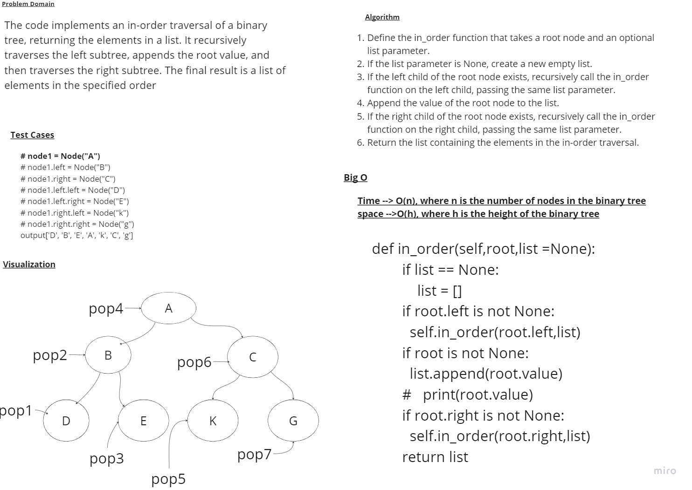
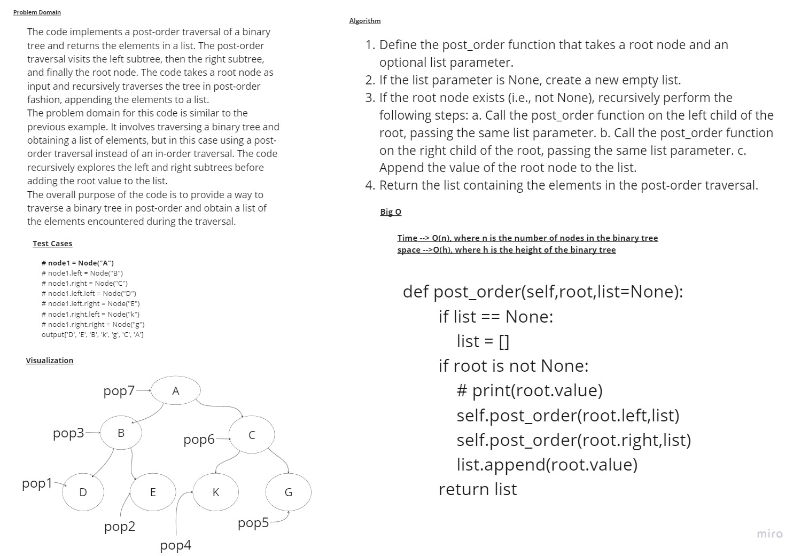
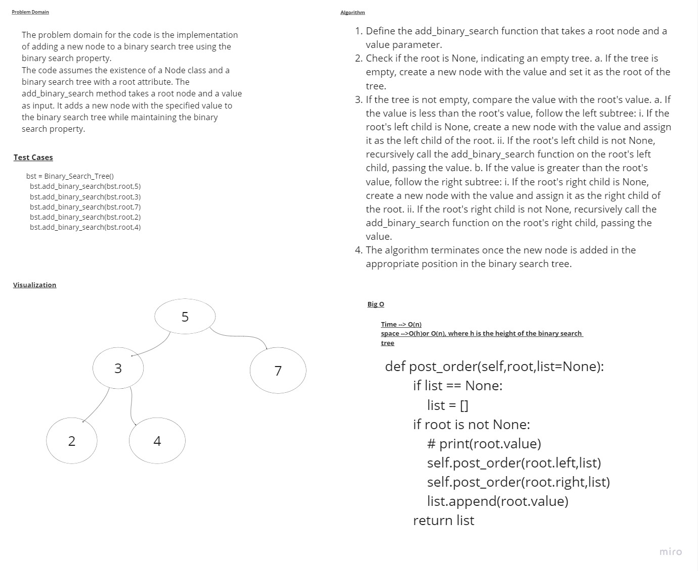

# Challenge Title
##  Implementation:Implementation: Trees
# Whiteboard Process




## Setup
requirement.txt to install the requred


### to test code 
install pytest to run the test
 ```
 pytest
 ```
 ### to run a code 
 ```
 /home/mohammad/.pyenv/versions/3.10.7/bin/python /home/mohammad/data-structures-and-algorithms/challenges/tree/main_tree.py
 ```